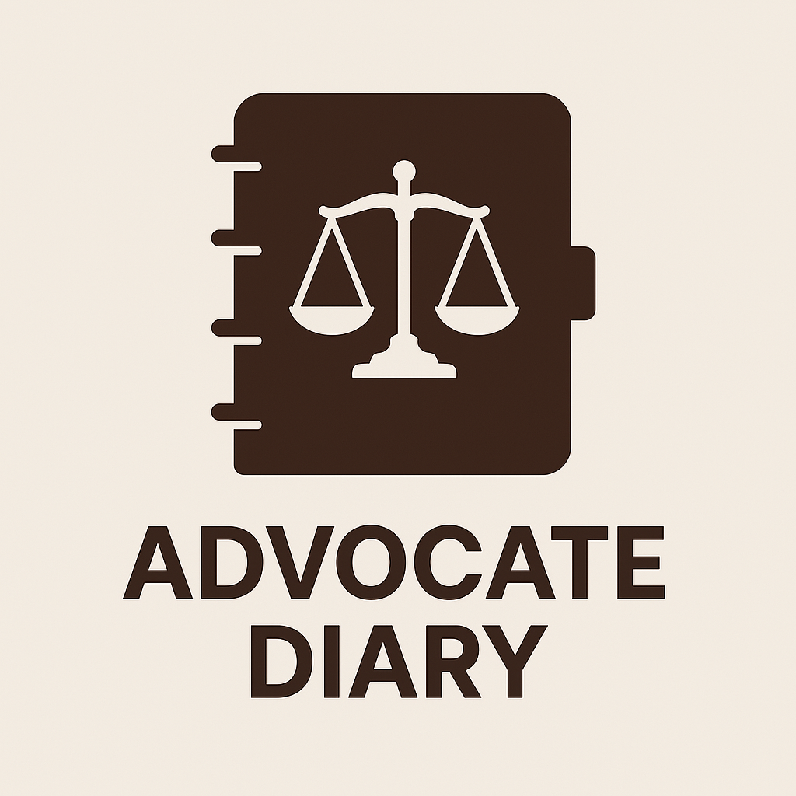
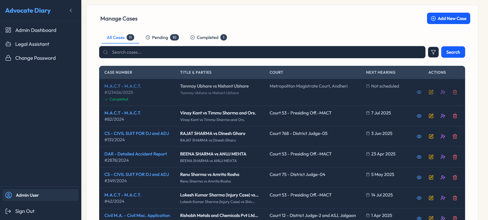
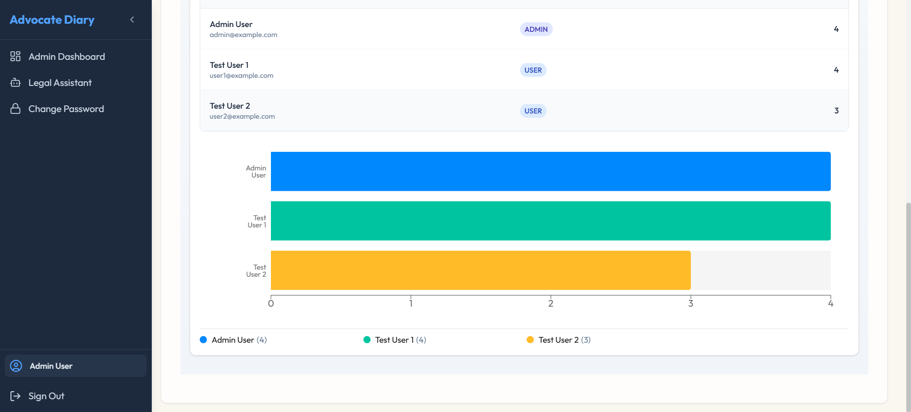
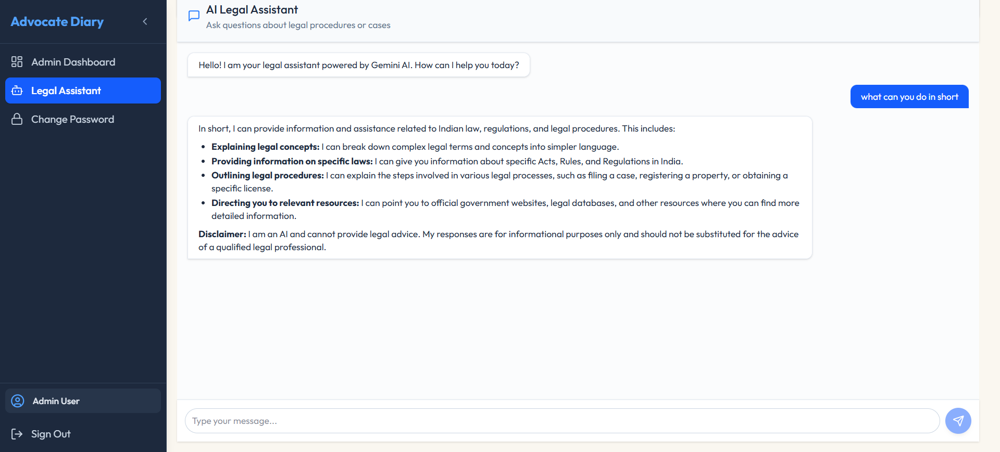
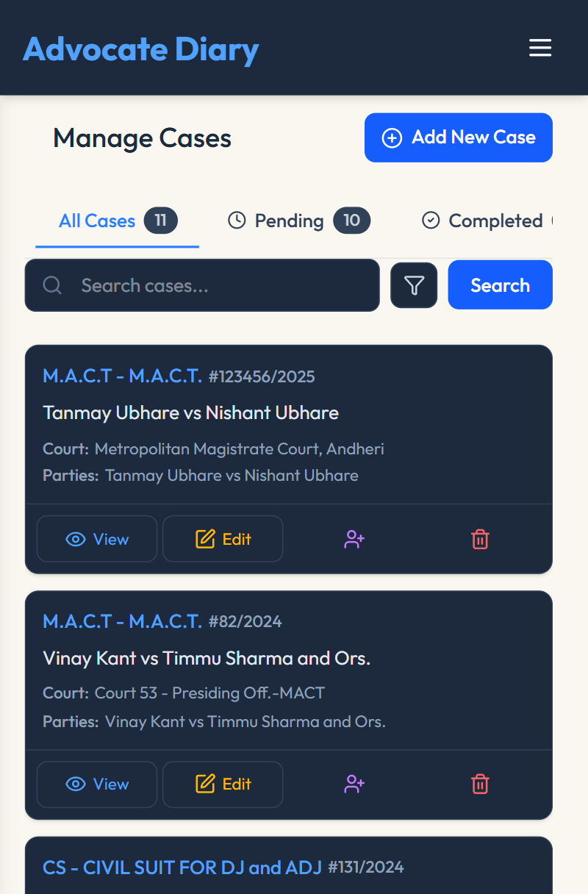
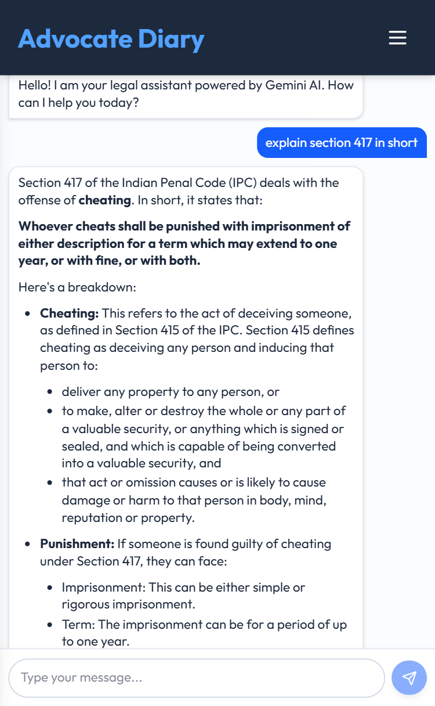
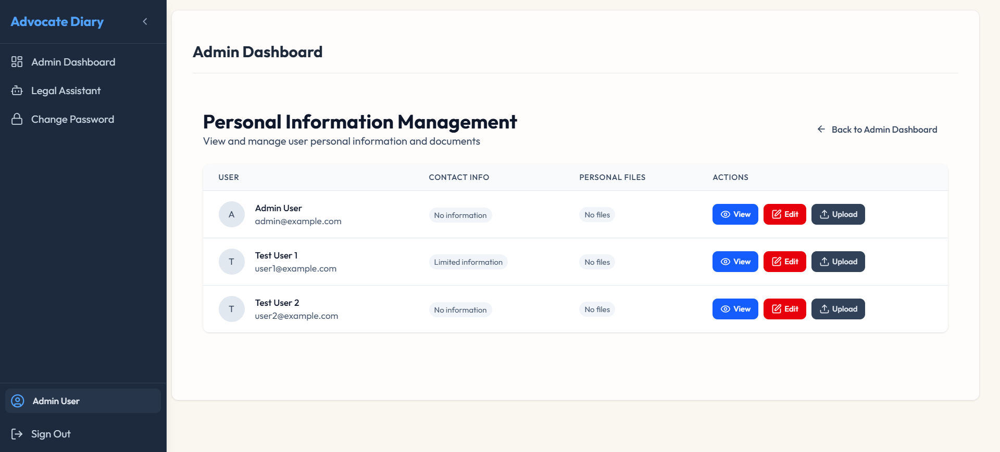

# 🧑‍⚖️ Advocate Diary App

<div align="center">
  


</div>

<p align="center">
  
</p>

An AI-powered legal case management system designed for modern law firms to streamline case management, enhance productivity, and provide AI-assisted legal insights.

## 🌟 Features

### 🤖 Smart Advocate Assistant

Our application combines AI-powered legal research with efficient scheduling and document management, making legal tasks more accessible and efficient.

### 📒 Advocate Diary

- **Firm Management**: Admin case allocation, transfers, and statistical dashboards
- **Schedule Management**: Automated hearing scheduling with integrated management features

### ⚖️ Case Tracking & Management

- **Comprehensive Case Information**: Court details, dates, legal sections, parties
- **Document Management**: Chronological document uploads with timestamps
- **History & Notes**: Complete historical hearing records and note-making

### 🧠 AI Legal Assistant

- **Legal Research**: Relevant legal articles and case law suggestions
- **Document Generation**: Create standard legal drafts (adjournments, petitions)
- **24/7 Availability**: Instant access to legal information and assistance

## 🎛️ Admin Panel

- **User Management**: Create, update, and remove lawyer accounts
- **Case Management**: Track unallocated cases, view case distribution statistics
- **Bulk Operations**: Transfer multiple cases between advocates
- **Case Overview**: View, edit, reassign and manage all cases

## 👤 User Panel

- **Case Dashboard**: View assigned cases with hearing dates, client details
- **Progress Tracking**: Update case progress, add notes, reschedule hearings
- **Document Library**: Upload and access case-related documents
- **AI Assistant**: Access AI-driven retrieval for similar cases and legal articles

## 🛠️ Technical Stack

<div align="center">
  
| Frontend | Backend | Database | Auth & Security | Testing |
|----------|---------|----------|----------------|---------|
| Next.js 15 | Node.js | PostgreSQL | NextAuth.js | Pytest |
| React | Next.js API Routes | Prisma ORM | CSRF Protection | Playwright |
| TypeScript | Server Actions | JSON | JWT | Requests |
| Tailwind CSS | | | Bcrypt | |

</div>

## 🚀 Getting Started

### Prerequisites

- Node.js v18+
- PostgreSQL database
- Python 3.8+ (for testing)
- npm or pnpm

### Installation

1. **Clone the repository**

```bash
git clone https://github.com/your-username/advocate-diary-app.git
cd advocate-diary-app
```

2. **Install dependencies**

```bash
npm install
# or
pnpm install
```

3. **Configure environment variables**

```bash
cp .env.example .env
# Edit .env file with your database and authentication settings
```

4. **Set up the database**

```bash
npx prisma migrate dev
npx prisma db seed
# (quick and handy way to reset)
npx prisma migrate reset
```

5. **Start the development server**

```bash
npm run dev
# or
pnpm dev
```

6. **Access the application**

   The app will be available at [http://localhost:3000](http://localhost:3000)

## 🧪 Testing

### Test Environment Setup

Create a Python virtual environment for testing:

```bash
python -m venv .venv
source .venv/bin/activate  # On Windows: .venv\Scripts\activate
pip install pytest requests playwright pytest-playwright
playwright install chromium # Setup playwright for e2e testing
```

### Running Tests

The application includes several test suites:

#### API Tests

```bash
# Test user operations (create/delete users)
python -m pytest tests/test_user_operations.py

# Test case operations (create/delete cases)
python -m pytest tests/test_case_operations.py

# Test authentication API
python -m pytest tests/test_api_login.py
```

#### Unit Tests

```bash
# Auth unit tests
python -m pytest tests/test_auth_unit.py

# Form validation tests
python -m pytest tests/test_form_validation.py
```

#### E2E Tests with Playwright

```bash
# Run end-to-end login tests
python -m pytest tests/test_login_e2e.py
```

#### Run All Tests

```bash
python -m pytest
```

Running pytest automates testing process and generates `report.html`

### Test Reports

View the latest automated test report: [https://kshg9.github.io/advocate-diary-app/report.html](https://kshg9.github.io/advocate-diary-app/report.html)

## 📸 Screenshots

<div align="center">
  
</div>

<div align="center">
  
</div>

<div align="center">
  
</div>

### 📱 Mobile Views

<div align="center">
  <table>
    <tr>
      <td align="center"></td>
      <td align="center"></td>
    </tr>
    <tr>
      <td align="center"><b>Cases Dashboard</b></td>
      <td align="center"><b>AI Assistant</b></td>
    </tr>
  </table>
</div>

<div align="center">
  
  <p><b>User Profile & Personal Information</b></p>
</div>

## 🔄 API Endpoints

The application provides RESTful API endpoints for cases and users:

### Cases

- `GET /api/cases`: Get all cases (filtered by user role)
- `POST /api/cases`: Create a new case
- `GET /api/cases/:id`: Get a specific case
- `PUT /api/cases/:id`: Update a case
- `DELETE /api/cases/:id`: Delete a case

### Users

- `GET /api/admin/users`: Get all users (admin only)
- `POST /api/admin/users`: Create a new user (admin only)
- `GET /api/admin/users/:id`: Get a specific user (admin only)
- `DELETE /api/admin/users/:id`: Delete a user (admin only)

## 📜 License

This project is currently Unlicenced - will be changed later.

## 🌐 Project Website

Visit our project website for more information and documentation:
[https://kshg9.github.io/advocate-diary-app/](https://kshg9.github.io/advocate-diary-app/)
